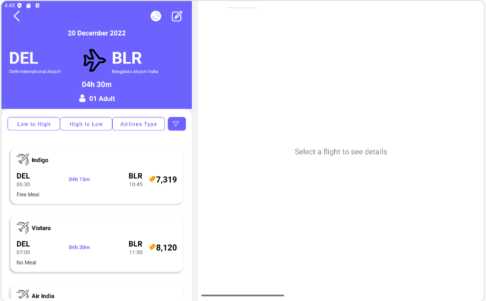

Android Flight Booking App (Tablet UI)
Ce projet est une application de démonstration Android conçue pour les tablettes. Elle présente une interface de réservation de vols en utilisant une disposition Maître-Détail (Master-Detail).

L'application affiche une liste de vols disponibles sur le côté gauche de l'écran. Lorsqu'un utilisateur sélectionne un vol dans la liste, les détails complets de ce vol s'affichent sur le côté droit de l'écran.

## ✨ Fonctionnalités

**Interface Maître-Détail :** L'écran principal est divisé en deux panneaux...

**Liste des vols :** Un `RecyclerView` affiche une liste verticale des vols...

**Panneau de détails dynamique :** Le panneau de droite est un `Fragment`...

🛠️ Technologies et Concepts Démontrés
Langage : Kotlin

Architecture : Interface Maître-Détail (Liste-Détail)

Composants de l'interface utilisateur (UI) :

RecyclerView avec un Adapter et un ViewHolder personnalisés.

Fragment pour afficher le contenu dynamique.

FragmentTransaction pour remplacer le fragment de détails.

CardView pour une interface utilisateur moderne et épurée.

LinearLayout et ConstraintLayout pour la mise en page.

Liaison de données :

ViewBinding pour lier en toute sécurité les vues XML au code Kotlin.

Gestion des données :

@Parcelize pour une sérialisation efficace des objets de données.

📂 Structure du Projet
Voici les fichiers clés de ce projet et leur rôle :

MainActivity.kt: L'activité principale qui gère le RecyclerView (la liste "Maître") et héberge le conteneur du Fragment ("Détail").

FlightsAdapter.kt: L'adaptateur pour le RecyclerView qui gère l'affichage de la liste des vols.

FlightDetailFragment.kt: Le Fragment qui affiche les informations détaillées d'un vol sélectionné.

Flight.kt: La data class qui définit le modèle de données pour un Flight.

activity_main.xml: La disposition principale de l'application (le conteneur Maître-Détail).

item_fight.xml: La disposition XML pour une seule ligne dans le RecyclerView.

details_card.xml: La disposition XML pour la vue détaillée du ticket affichée dans le Fragment.
